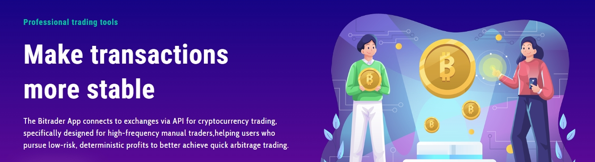

# Is Bitrader a Exchange?

<figure><figcaption></figcaption></figure>

## Is Bitrader an Exchange?

Bitrader is not an exchange.

Bitrader is an app that connects to exchanges through APIs, currently supporting the OKX exchange. After users configure their API (which they obtain from OKX) within the Bitrader App, they can use Bitrader to conduct cryptocurrency trades (currently limited to OKX USDT-based perpetual contract pairs).

The user's cryptocurrency assets remain in their exchange account, where they are fully managed by the user. Bitrader does not manage or hold any user cryptocurrency assets.
