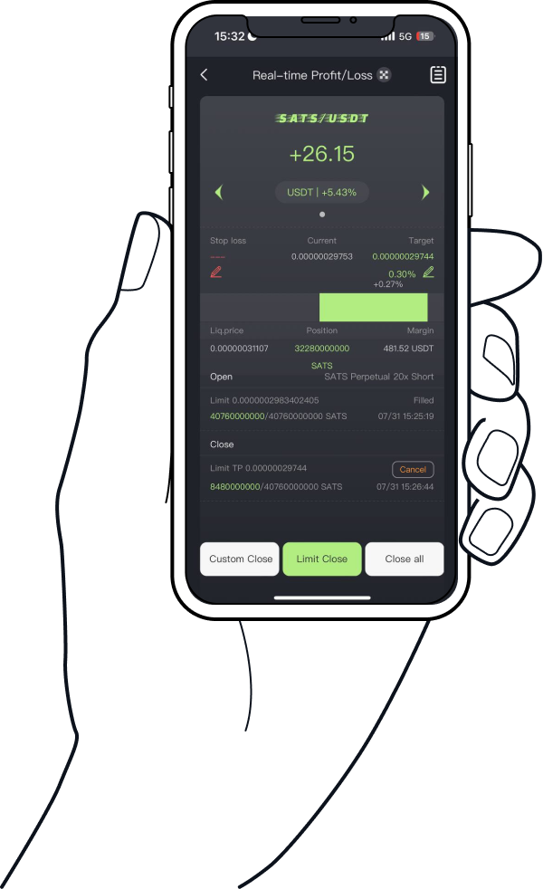

# STEP3：Place Order & Market Speculation

**Place Order**

Once you've completed the previous two steps, simply click the **Open Long** or **Open Short** button to place your order. Bitrader will then automatically redirect you to the **Real-Time Profit and Loss** screen. Here, you can monitor the status of your order, including whether it has been filled and the real-time profit or loss of your position.

**Market Speculation**

The **Real-Time Profit and Loss** screen provides you with comprehensive information about your positions and the market, including:

* **Real-Time P\&L**: The current profit or loss on your position.
* **Position Status**: Whether your position is open or closed.
* **Transaction Price**: The price at which your order was executed.
* **Current Price**: The current market price.
* **Take Profit/Stop Loss Prices**: The prices at which your position will automatically close to secure profit or limit loss.
* **Liquidation Price**: The price at which your position would be forcefully liquidated by the exchange.
* **Position Status**: The current state of your open position.
* **Real-Time Profit Progress**: A visual representation of your position's performance.

<figure><figcaption></figcaption></figure>

#### Bitrader's Automated Order Placement

By following the above steps, you've likely set up both an opening and closing order simultaneously. After your position is opened, Bitrader automatically places a closing order for you. If the market price reaches your set closing price, the system will automatically execute the close, securing your profit or limiting your loss.

#### Trading Risk Management

As with any trading platform, it’s crucial to keep an eye on market trends. If the market moves rapidly against your expectations, Bitrader provides **Limit Close** and **Market Close** buttons for quick exit strategies. These options enable you to swiftly close your position and minimize losses, ensuring you have control over your trades even in volatile market conditions.
