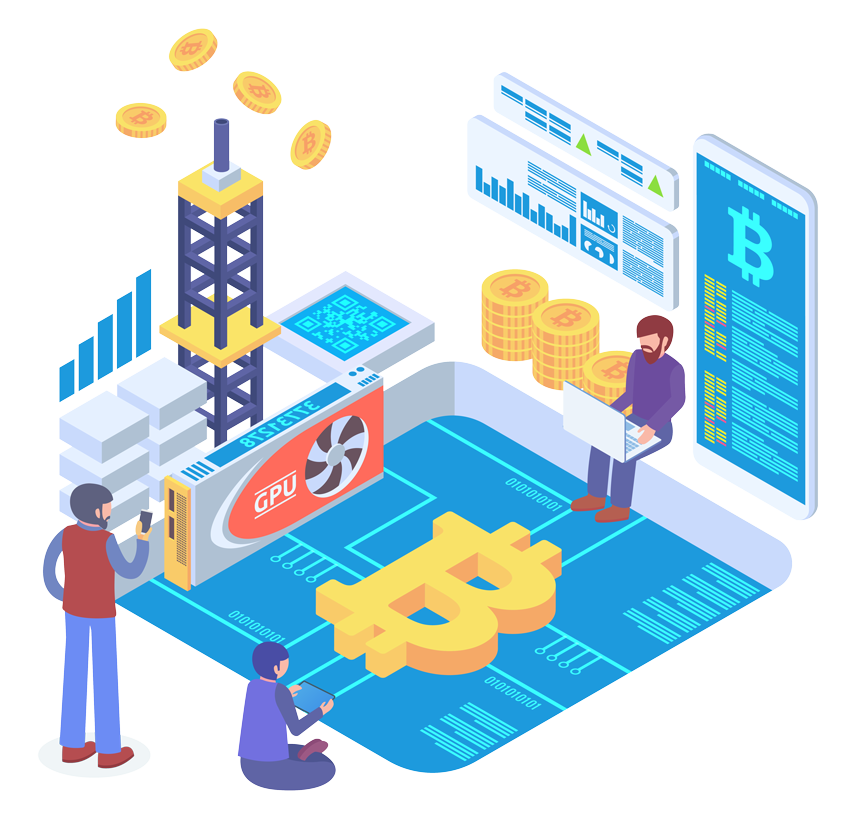

# Bitrader Token Applications

<figure><figcaption></figcaption></figure>

## Bitrader Token Application

When users connect to an exchange via the Bitrader App (using an API), they can not only utilize the trading tools for free but also earn additional "extra" rewards.


Rewards are distributed in the form of **Bitrader Tokens**, including the following:

* **Invitation Rewards**: For inviting new users to the platform.
* **Trading Rewards**: Earned by both the user and the people they invite when trades are conducted.
* **Node Rewards**: If the user operates as a node, they can receive additional rewards.
* **Platform Rewards**: Bonuses provided by the platform for active participation.


## Bitrader Token Price Appreciation

Bitrader will utilise 90% of profit to buy back Bitrader Token。

## Bitrader Token Staking

In the future, more advanced features will gradually be unlocked for users who hold Bitrader Tokens
